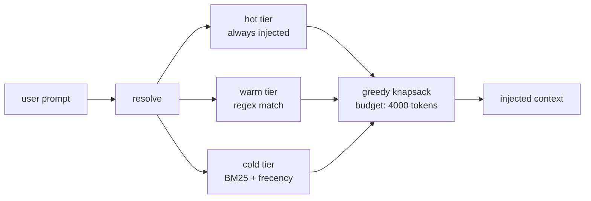

# memshot

[](https://www.npmjs.com/package/@ayberkaya/memshot)
[](./LICENSE)

Your agent's memory shouldn't cost 15,000 tokens before the user says hello.

memshot is a tiered, token-budget-aware memory library for LLM agents. Zero dependencies. No vector DB. No server. Works anywhere JavaScript runs.

### The problem

mem0's blog puts it plainly: *"Your AI Agent's Memory Is Just a File? That's the Problem."*

Most memory libraries have no selection layer. At 500 stored memories you're injecting ~18,000 tokens on every request — regardless of what the user asked. The signal-to-noise ratio collapses.

### How memshot fixes it



| Tier | Selection | When to use |
|------|-----------|-------------|
| **hot** | Always included. `once: true` = once per session. | Identity, system facts, permanent instructions |
| **warm** | Included only when a `triggers` regex matches the current prompt. | Domain knowledge, project-specific context |
| **cold** | BM25 keyword score + frecency decay, greedy score/token ratio pick until budget is exhausted. | Conversation history, past decisions, event log |

### Quick Start

```bash
npm install @ayberkaya/memshot
```

```ts
import { Memory, fileStore } from "@ayberkaya/memshot"

const mem = new Memory({ budget: 4000, store: fileStore("./memories") })

await mem.add({ content: "User prefers TypeScript over Python", tier: "hot" })
await mem.add({ content: "Project: helmops yacht management", tier: "warm", triggers: [/yacht|helm/i] })
await mem.add({ content: "Last session we discussed billing...", tier: "cold" })

const { text, tokensUsed } = await mem.resolve(userPrompt, { sessionId: "abc123" })
```

`fileStore` persists to disk as newline-delimited JSON. For in-process use, tests, and edge functions, swap in `memoryStore` instead.

### Benchmark

```text
memshot benchmark — 500 memories, 4000-token budget
─────────────────────────────────────────────────
                 naive   memshot   savings
items              500        62    -87.6%
tokens used     50,419     3,954    -92.2%
─────────────────────────────────────────────────
reproduce: npm run benchmark
```

Run it yourself:
```bash
git clone https://github.com/ayberkaya/memshot
cd memshot && npm install
npm run benchmark
```

### API Reference

#### `new Memory(config)`

| Field | Type | Required | Description |
|-------|------|----------|-------------|
| `budget` | `number` | yes | Max tokens to inject per `resolve` call |
| `store` | `Store` | yes | Storage backend (`fileStore` or `memoryStore`) |
| `tokenizer` | `Tokenizer` | no | Defaults to character-based estimate; plug in `gpt-tokenizer` for exact counts |
| `ledger` | `SessionLedger` | no | Tracks `once: true` items per session; defaults to in-memory |

#### `mem.add(item)`

Returns `Promise<MemoryItem>`.

| Field | Type | Required | Description |
|-------|------|----------|-------------|
| `content` | `string` | yes | The text to store |
| `tier` | `"hot" \| "warm" \| "cold"` | yes | Selection tier |
| `triggers` | `RegExp[]` | no | Warm tier: inject only when one of these matches the prompt |
| `once` | `boolean` | no | Hot tier: inject only once per `sessionId` |
| `tags` | `string[]` | no | Arbitrary labels, available on retrieved items |

#### `mem.resolve(prompt, opts)`

| Param | Type | Description |
|-------|------|-------------|
| `prompt` | `string` | Current user input; used for warm trigger matching and BM25 cold ranking |
| `opts.sessionId` | `string` | Identifies the session for `once: true` deduplication |
| `opts.now` | `number` | Unix ms timestamp; defaults to `Date.now()`. Override in tests. |

Returns `Promise<ResolveResult>`.

#### `ResolveResult`

| Field | Type | Description |
|-------|------|-------------|
| `text` | `string` | Ready-to-inject memory block; prepend to your system prompt |
| `items` | `MemoryItem[]` | The selected items in tier order |
| `tokensUsed` | `number` | Total tokens consumed by this resolve |
| `tiersUsed` | `{ hot, warm, cold: number }` | Item count per tier |
| `dropped` | `{ warm, cold: number }` | Items that exceeded the budget and were excluded |

#### Tiers

**hot** — Injected on every call. Use for identity, persistent instructions, and system facts. Set `once: true` to inject once per `sessionId`, useful for session-opening context that should not repeat mid-conversation.

**warm** — Injected when at least one `triggers` regex matches the current prompt. Items without `triggers` are always included when tier is warm. Use for domain knowledge that is irrelevant outside its context.

**cold** — Ranked by a composite score: 60% BM25 keyword relevance + 40% frecency, frequency × recency decay. Items are selected greedily by score/token ratio until the remaining budget is consumed.

### Adapters

#### Express middleware

```ts
import { memshotMiddleware } from "@ayberkaya/memshot/adapters/express"

app.use(memshotMiddleware(mem, {
  getPrompt: (req) => req.body.messages.at(-1)?.content ?? "",
  getSessionId: (req) => req.headers["x-session-id"] ?? ""
}))

app.post("/chat", (req, res) => {
  const systemPrefix = req.memshot.text
})
```

#### Next.js route handler

```ts
import { withMemshot } from "@ayberkaya/memshot/adapters/next"

export const POST = withMemshot(mem, async (req, { memshot }) => {
  const systemPrefix = memshot.text
  return Response.json({ ok: true })
})
```

#### Claude Code hook (UserPromptSubmit)

```ts
import { createClaudeHook } from "@ayberkaya/memshot/adapters/claude-hook"

const hook = createClaudeHook(mem)
await hook.run()
```

Register in `.claude/settings.json`:

```json
{
  "hooks": {
    "UserPromptSubmit": [
      { "type": "command", "command": "node ./hooks/memory.js" }
    ]
  }
}
```

### Why not X?

| | memshot | mem0 | basic-memory | Zep |
|---|---|---|---|---|
| Zero dependencies | ✓ | ✗ | ✗ | ✗ |
| Token-budget-aware | ✓ | ✗ | ✗ | ✗ |
| No vector DB | ✓ | ✗ | ✓ | ✗ |
| TypeScript-native | ✓ | ✗ | ✗ | ✗ |
| No server needed | ✓ | ✗ | ✓ | ✗ |
| Runs in Edge/Serverless | ✓ | ✗ | ✗ | ✗ |

[](https://star-history.com/#ayberkaya/memshot&Date)

### License

MIT